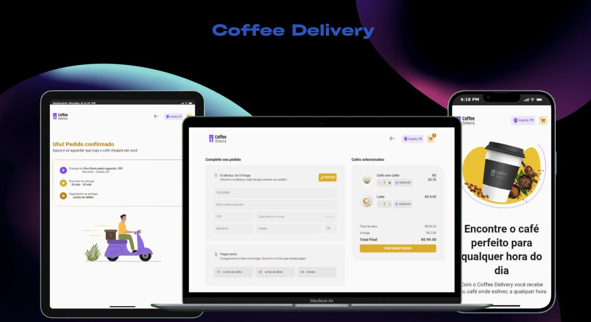

<h1 align="center">Coffee Delivery</h1>
<div align="center">
  <a href="#descrição">Descrição</a> |
  <a href="#iniciar">Iniciar</a> |
  <a href="#licença">Licença</a>
</div>

<p align="center">
  
</p>
<p>
 
</p>

## Descrição

O projeto é uma site para vendas de café, com diferentes formas de preparo. A compra e feita no site, e enviada direto para o cliente sem precisar sair de casa.

O site foi promovido com desafio final do modulo 2, do curso de react na 🔗[RocketSeat](https://app.rocketseat.com.br/). Tendo sido aprimorado por min, com a integração de um back end e a criação de testes automatizados.

As principais funções do site são:

- Registro de endereço.
- Atualização de registro de endereço.
- Auto complete do endereço usando o back end de forma completa ou API [ViaCep](https://viacep.com.br/) de busca de localização por cep, de forma incompleta.
- Filtro de produtos registrado

Acesse o site 🔗[Coffee Delivery](https://matheus369k.github.io/coffee-delivery/).

## Iniciar

E Necessário ter o Nodejs, o git instalado e o repositório **[coffee-delivery-api](https://github.com/matheus369k/coffee-delivery-api)**.

Faça clone do repositório localmente.

```bash
git clone https://github.com/matheus369k/coffee-delivery.git
cd ./coffee-delivery
```

Instale as dependencies

```bash
npm i
```

Crie um arquivo **.env**, com as variaves ambientes abaixo

```bash
VITE_RENDER_API_URL="https://localhost:3333"
```

Agora você pode iniciar o projetos

```bash
npm run dev
```

## Licença

Licença usada **[MIT](./LICENSE.txt)**
